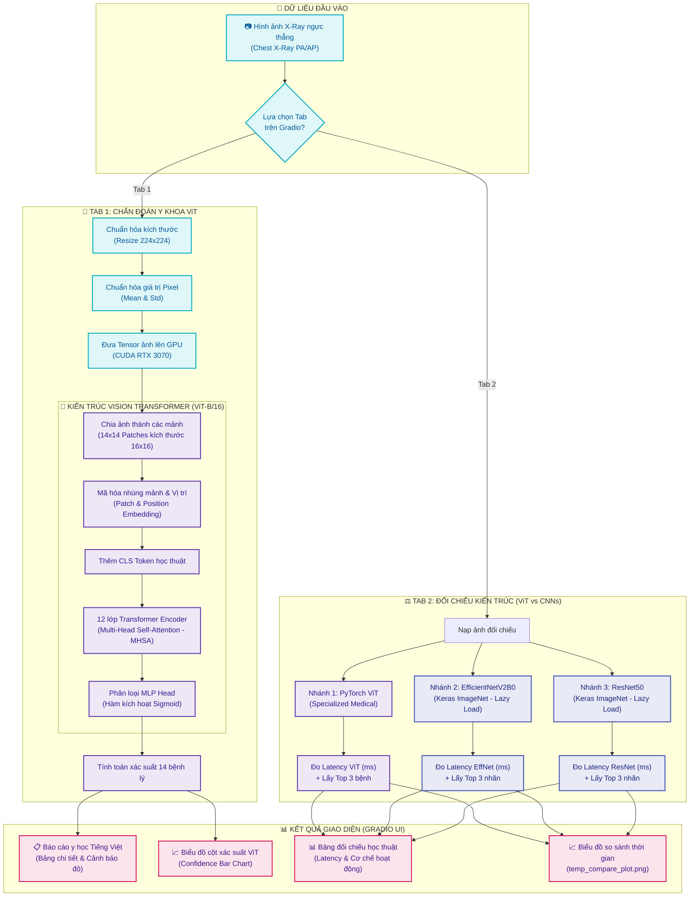

# 🏥 LƯU ĐỒ HOẠT ĐỘNG HỆ THỐNG CHẨN ĐOÁN PHỔI VISION TRANSFORMER (ViT)

Tài liệu này cung cấp **Lưu đồ Hệ thống (Mermaid Flowchart)** trực quan cùng phần mô tả luồng xử lý chi tiết từ lúc người dùng nạp ảnh X-Ray ngực thẳng cho đến khi xuất báo cáo y khoa và phân tích so sánh cấu trúc CNNs.

---

## 1. Sơ đồ lưu đồ hệ thống (System Flowchart)

Dưới đây là lưu đồ hoạt động chi tiết được thiết kế dưới dạng mã **Mermaid**. Sơ đồ phân tách rõ ràng thành 3 phân vùng chính: **Dữ liệu đầu vào**, **Khối xử lý trung tâm (ViT vs CNNs)**, và **Đầu ra giao diện (Gradio UI)**.

---

## 2. Giải thích các khối xử lý chính trong lưu đồ

### 🏥 Phân khu 1: Tiền xử lý dữ liệu y khoa
*   **Resize (224x224)**: Đưa ảnh chụp X-Ray về kích thước chuẩn mà Vision Transformer đòi hỏi.
*   **Normalization**: Áp dụng phân phối trung bình và độ lệch chuẩn y khoa để giữ nguyên độ tương phản của xương sườn và các nhu mô phổi.

### 🧠 Phân khu 2: Cốt lõi kiến trúc Vision Transformer (ViT-B/16)
*   **Patch Extraction**: Chia bức ảnh $224 \times 224$ thành $196$ mảnh nhỏ kích thước $16 \times 16$ pixel. Điều này giúp chuyển đổi dữ liệu không gian 2D thành chuỗi dữ liệu 1D tuần tự.
*   **Transformer Encoder Blocks**: Chứa 12 lớp mã hóa với cơ chế **Tự chú ý đa đầu (Multi-Head Self-Attention)**. Tại đây, mô hình tự động tìm kiếm mối liên kết y khoa giữa các vùng phổi khác nhau (ví dụ: phổi trái bị tràn dịch thường liên quan đến góc sườn hoành bị tù).
*   **MLP Head (Sigmoid activation)**: Đầu ra chẩn đoán đa nhãn (Multi-label classification). Sử dụng hàm Sigmoid cho phép dự đoán độc lập xác suất mắc 14 hội chứng phổi y khoa đồng thời (một bệnh nhân có thể mắc nhiều tổn thương cùng lúc).

### ⚖️ Phân khu 3: Đối chiếu kiến trúc song song
*   **Lazy Loading**: Chỉ khi người dùng bấm nút phân tích ở Tab 2, TensorFlow mới tải các mô hình CNN là `EfficientNetV2B0` và `ResNet50` vào bộ nhớ RAM/VRAM.
*   **Inference Latency Benchmarking**: Sử dụng đồng hồ bấm giờ độ chính xác cao (`time.perf_counter`) để đo chính xác tốc độ suy luận của từng kiến trúc trên phần cứng hiện tại, chứng minh ưu thế/nhược điểm của cơ chế Attention so với Convolution.

---

## 3. Giá trị học thuật và vai trò trong đồ án tốt nghiệp

Lưu đồ hệ thống này là bản đồ kiến trúc cốt lõi trực quan hóa toàn bộ nội dung nghiên cứu thực nghiệm được trình bày chi tiết trong báo cáo đồ án tốt nghiệp của nhóm:
1.  **Minh họa trực quan cho CHƯƠNG 6 (Kiến trúc Vision Transformer y khoa)**: Thể hiện trực quan quy trình xử lý ảnh từ chia mảnh (Patch Extraction) đến nhúng vị trí (Position Embedding) và 12 lớp Transformer Encoder (Self-Attention) tự chú ý toàn cục để chẩn đoán tổn thương phổi lâm sàng.
2.  **Minh họa trực quan cho CHƯƠNG 7 (Thực nghiệm & Đối chiếu so sánh CNNs)**: Trực quan hóa tiến trình suy luận song hành cùng lúc 3 nhánh mô hình (ViT-B/16 y khoa chuyên dụng đạt kỷ lục **78.93% Mean AUC** so với baseline ResNet50 đạt 68.20% và EfficientNetV2B0 đạt 65.50%) và đo lường tốc độ suy luận Latency (ms) thực tế trên card đồ họa chuyên dụng GPU NVIDIA GeForce RTX 3070.
3.  **Ý nghĩa lâm sàng thực tiễn**: Minh chứng rõ nét tính khả thi khi tích hợp mô hình AI chuyên sâu vào hệ thống phần mềm tương tác Gradio UI hỗ trợ bác sĩ chẩn đoán đa nhãn lâm sàng nhanh chóng, trực quan.
